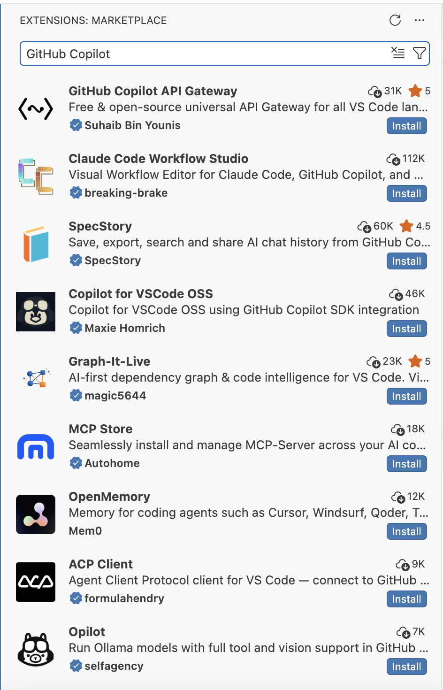

# Overview

This report is my reflection on the W07 Introduction to Positron module. For this assignment, I downloaded Positron, tried making a Quarto file in it, and looked at how AI tools could be used in the app. I’m still more used to RStudio, so Positron felt new to me, but I was able to get the basic parts working.

# Essay Prompts and Responses

## Download and Install Positron

**Prompt:** Download and install Positron. As you watch the videos in Step 1 and Step 3, follow the activities in the video and be familiar with Positron.

I downloaded and installed Positron for this assignment. At first, I wasn’t really sure where everything was because I’m more used to RStudio. Once I opened my folder, I was able to make a Quarto file and render the HTML. That helped me see that Positron can still do the same report work we’ve been doing, even though the layout looks different.

## Positron Compared with RStudio

**Prompt:** Based on what you learned from Step 1 and Step 3, what do you like about Positron compared with RStudio?

One thing I liked about Positron is that it looks more modern. The side panel, file explorer, terminal, and viewer are all in one place, but it still took me a little time to figure out where things were. Compared with RStudio, Positron reminds me more of VS Code. I’m still more comfortable with RStudio right now because I’ve used it more, but I can see how Positron could be useful once I get used to it.

## Ways to Use AI Inside Positron

**Prompt:** In Step 4, the video demonstrates how you can use AI. Describe the various ways you can use AI inside Positron. Some are free while others are not.

From what I understood, AI inside Positron can help with writing code, explaining code, fixing errors, and giving suggestions while working. I think that could be useful because sometimes I get stuck and don’t know if the issue is from the code, the package, or something small I missed. Some AI tools are free, but others may need a paid account or a student account, like GitHub Copilot. I think AI could help me learn, but I’d still need to check what it gives me because it might not always match the assignment.

## AI Tools I Installed or Set Up

**Prompt:** Which AI tools have you installed or set up? Which AI tools did you find beneficial for you?

I tried to set up GitHub Copilot in Positron, but I had trouble finding the official GitHub Copilot extension. When I searched for it, a lot of other Copilot related tools came up instead, so I didn’t fully get it working. I still think it could be helpful if it was set up correctly because it could give code suggestions and help explain errors. For me, that would be useful because I still second guess myself when I’m coding.

## GitHub Copilot Reflection

**Prompt:** I strongly recommend using GitHub Copilot, which is free if you apply for an education account. Apply for it and take a screenshot showing you were accepted into the education program. Play with it and do you find it helpful or distracting? Please elaborate.

I looked into GitHub Copilot, but I wasn’t able to fully use it inside Positron yet. The setup part was confusing because I couldn’t clearly find the official extension in the marketplace. I think Copilot would probably be helpful once it works because it could suggest code or help explain errors. At the same time, I could see it being distracting if I just accept the suggestions without understanding them. I think I’d use it more as a helper, not something that does the whole assignment for me.

## GitHub Pages

**Prompt:** Publish this report to GitHub Pages and provide a URL to the GitHub Pages for the report. Note that although both GitHub Pages and GitHub repo are online, they are different. GitHub Pages is a website publishing service that hosts the rendered HTML from a QMD file.

I will publish this report to GitHub Pages after I render the HTML file. From what I understand, the GitHub repository is where the files are stored, and GitHub Pages is what shows the finished HTML report as a website. The GitHub Pages URL for this report is:

**URL:** 